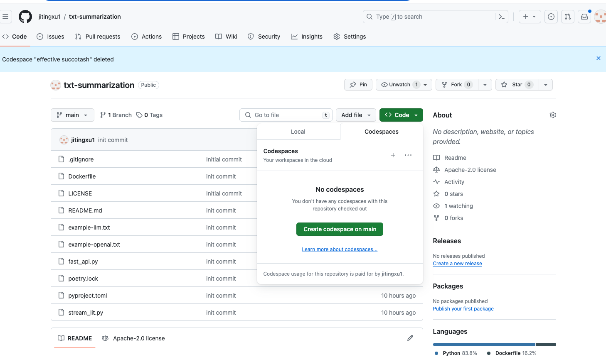
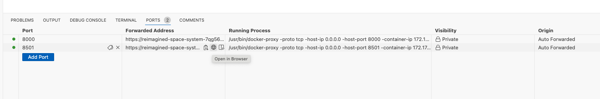
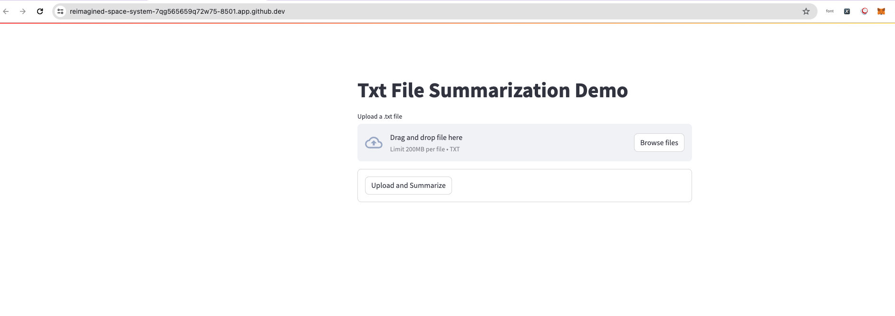
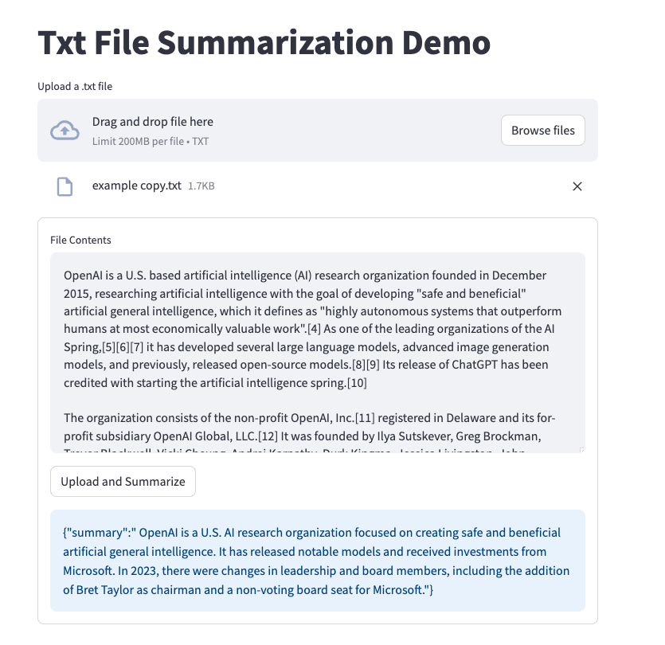

# txt-summarization


**note**: my openai_api_key was deleted.

## Test in github codespace

### 1. create codespace on main


### 2. run it uaing docker

#### Copy your openai_api_key to the `.env` file
```bash
OPENAI_API_KEY=xxx 
```

#### Run docker
```bash
docker build -t summarization-app .
docker run -p 8000:8000 -p 8501:8501 summarization-app
```

#### Find the app link
find the port `8501`, go to the forward address, click the `open in browser`



#### Upload .txt file for summrization



#### Check the output


